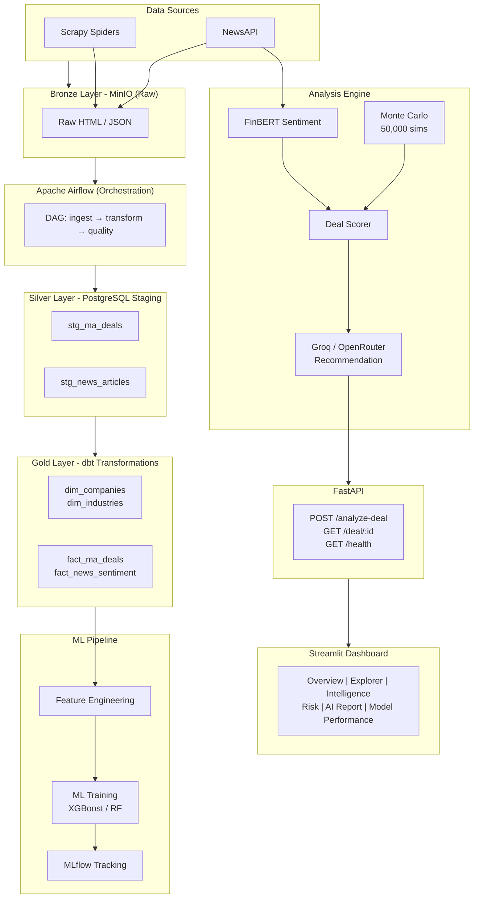

# DealSense AI — AI-Powered M&A Intelligence Platform

> **Build status:**  

---

## What is DealSense AI?

DealSense AI is a production-grade, end-to-end platform that automates **Mergers & Acquisitions due diligence** by combining data engineering, ML, NLP, financial simulation, and LLM intelligence into a unified pipeline.

It takes a proposed deal (e.g., "Adobe acquiring Figma") and returns:

- ✅ **Deal success probability** (ML model)
- 📰 **Market sentiment score** (FinBERT + NewsAPI)
- 🎲 **50,000 simulated outcomes** (Monte Carlo NPV/IRR/VaR)
- 🤖 **AI recommendation** — `PROCEED` | `NEGOTIATE` | `REJECT`
- 📋 **Executive summary** (LLM-generated)

---

## Architecture

## Architecture Diagram



### Data Flow Summary

| Layer | Technology | Purpose |
|-------|-----------|---------|
| **Bronze** | MinIO (S3) | Raw HTML, JSON, API responses |
| **Orchestration** | Airflow | DAG scheduling, retries, alerting |
| **Silver** | PostgreSQL Staging | Parsed, validated raw data |
| **Gold** | dbt | Star-schema warehouse transformations |
| **ML** | scikit-learn / XGBoost | Deal success prediction |
| **NLP** | FinBERT (HuggingFace) | News sentiment scoring |
| **Simulation** | NumPy / SciPy | 50,000 Monte Carlo iterations |
| **LLM** | Groq / OpenRouter / Gemini | Recommendation + executive summary |
| **API** | FastAPI + Pydantic | REST endpoints |
| **Dashboard** | Streamlit + Plotly | Interactive visualizations |
| **Tracking** | MLflow | Experiment versioning |
| **Quality** | Great Expectations | Schema + null rate validation |

---

## Quick Start

> Requires **Docker** and **Docker Compose v2+**

```bash
# 1. Clone the repository
git clone https://github.com/dealsense/dealsense-ai.git
cd dealsense-ai

# 2. Configure environment
cp .env.example .env
# Edit .env and add your API keys:
#   - NEWS_API_KEY (https://newsapi.org)
#   - GROQ_API_KEY  (https://console.groq.com)
#   - GEMINI_API_KEY (https://aistudio.google.com)

# 3. Launch entire stack
make up

# 4. Initialize database schema
make init-db

# 5. Seed sample data
make seed-db

# 6. Open the dashboard
open http://localhost:8501

# 7. Analyze a deal via API
curl -X POST http://localhost:8000/analyze-deal \
  -H "Content-Type: application/json" \
  -d '{"acquirer": "Microsoft", "target": "GitHub", "industry": "Software", "deal_value_usd": 7500000000}'
```

**Five commands to full stack.** That's it.

---

## Project Structure

```
dealsense-ai/
├── .env.example                 # All environment variables
├── Makefile                     # Automation commands (make up, make test, etc.)
├── README.md                    # This file
│
├── docker-compose.yml          # Full stack: Postgres, MinIO, Airflow, MLflow,
│                               #   FastAPI, Streamlit
│
├── docker/                     # Docker-related files
│   └── init-scripts/
│       ├── init.sql            # Schema: raw, staging, mart, ml, metadata
│       └── seed.sql            # 50 sample M&A deals + news articles
│
├── docker/Dockerfile.api       # FastAPI container
├── docker/Dockerfile.dashboard # Streamlit container
├── docker/Dockerfile.scraper   # Scrapy container
└── docker/Dockerfile.dbt       # dbt container
│
├── requirements/               # Python dependencies
│   ├── base.txt
│   ├── dev.txt
│   └── prod.txt
│
├── src/                        # Python source code
│   ├── ingestion/              # Bronze → MinIO loader
│   │   ├── __init__.py
│   │   ├── loader.py          # MinIO and Postgres ingestion
│   │   └── schemas.py         # Pydantic models for deal data
│   │
│   ├── features/              # Feature engineering
│   │   ├── __init__.py
│   │   └── feature_engineering.py  # Industry similarity, multiples, premiums
│   │
│   ├── models/                # ML training and prediction
│   │   ├── __init__.py
│   │   ├── train.py           # Training pipeline with MLflow
│   │   └── predict.py         # Prediction with confidence intervals
│   │
│   ├── simulation/            # Monte Carlo engine
│   │   ├── __init__.py
│   │   └── monte_carlo.py     # 50,000 simulations, NPV/IRR/VaR
│   │
│   ├── scoring/               # Deal scoring engine
│   │   ├── __init__.py
│   │   └── deal_scorer.py     # Combines ML + sentiment + simulation
│   │
│   ├── llm/                   # LLM integration
│   │   ├── __init__.py
│   │   ├── providers.py       # Groq / OpenRouter / Gemini wrappers
│   │   └── recommendation_engine.py  # Prompt builder + response parser
│   │
│   ├── api/                   # FastAPI application
│   │   ├── __init__.py
│   │   ├── main.py            # App entry, CORS, middleware
│   │   ├── config.py          # Settings from environment
│   │   ├── routes/
│   │   │   ├── __init__.py
│   │   │   ├── deals.py       # POST /analyze-deal, GET /deal/{id}
│   │   │   └── health.py      # GET /health
│   │   └── models.py          # Pydantic request/response schemas
│   │
│   └── dashboard/             # Streamlit dashboard
│       ├── app.py             # Main app + sidebar navigation
│       └── pages/
│           ├── 1_overview.py
│           ├── 2_deal_explorer.py
│           ├── 3_news_intelligence.py
│           ├── 4_risk_analysis.py
│           └── 5_ai_report.py
│
├── dags/                      # Apache Airflow DAGs
│   ├── ma_ingestion_dag.py    # Main ingestion pipeline
│   ├── ml_training_dag.py     # Weekly model retraining
│   └── news_sentiment_dag.py  # Daily news fetching
│
├── dbt/                       # dbt Core project
│   ├── dbt_project.yml
│   ├── profiles.yml
│   ├── packages.yml
│   └── models/
│       ├── raw/
│       │   └── sources.yml    # Source definitions
│       ├── staging/
│       │   ├── stg_ma_deals.sql
│       │   └── stg_news_sentiment.sql
│       ├── mart/
│       │   ├── dim_companies.sql
│       │   ├── dim_industries.sql
│       │   ├── fact_ma_deals.sql
│       │   ├── fact_news_sentiment.sql
│       │   └── deal_analysis_results.sql
│       └── ml/
│           └── feature_deal_model.sql
│
├── scraping/                  # Scrapy project
│   ├── scrapy.cfg
│   └── spiders/
│       ├── __init__.py
│       └── ma_deals_spider.py  # M&A deal scraper
│
├── tests/                     # pytest + coverage
│   ├── conftest.py            # Shared fixtures
│   ├── test_monte_carlo.py    # 50k simulation tests
│   ├── test_scorer.py         # Recommendation logic tests
│   ├── test_api.py            # API endpoint tests
│   ├── test_features.py       # Feature engineering tests
│   └── test_sentiment.py      # NLP pipeline tests
│
├── notebooks/                 # Jupyter exploration
│   ├── EDA_ma_deals.ipynb
│   ├── model_exploration.ipynb
│   └── monte_carlo_analysis.ipynb
│
├── .github/
│   └── workflows/
│       └── ci.yml             # GitHub Actions pipeline
│
└── .pre-commit-config.yaml   # pre-commit hooks
```

---

## API Contract

### `POST /analyze-deal`

**Request:**
```json
{
  "acquirer": "Microsoft",
  "target": "GitHub",
  "industry": "Software",
  "deal_value_usd": 7500000000
}
```

**Response:**
```json
{
  "deal_id": "550e8400-e29b-41d4-a716-446655440000",
  "acquirer": "Microsoft",
  "target": "GitHub",
  "deal_value_usd": 7500000000,
  "success_probability": 0.82,
  "sentiment_score": 0.64,
  "expected_npv": 2400000000,
  "probability_positive_npv": 0.78,
  "var_95": -850000000,
  "irr_median": 0.18,
  "recommendation": "PROCEED",
  "confidence": "HIGH",
  "executive_summary": "Based on analysis of 847 comparable deals...",
  "risk_factors": ["Integration complexity", "Regulatory approval uncertainty"],
  "key_metrics": {
    "ev_revenue_multiple": 25.0,
    "premium_paid": 0.49,
    "industry_success_rate": 0.71
  },
  "simulation_percentiles": {
    "p10": 800000000,
    "p25": 1500000000,
    "p50": 2400000000,
    "p75": 3500000000,
    "p90": 4800000000
  }
}
```

### `GET /health`
```json
{"status": "healthy", "version": "1.0.0", "services": {"postgres": "up", "minio": "up"}}
```

---

## Dashboard Screens

| Page | Description |
|------|-------------|
| **Executive Overview** | KPI cards, deal probability gauge, recommendation card |
| **Deal Explorer** | Filterable table of historical M&A deals with multiples |
| **News Intelligence** | Sentiment timeline, article headlines, sector trends |
| **Monte Carlo Risk** | NPV histogram, IRR distribution, VaR chart, percentile table |
| **AI Report** | Full LLM-generated executive summary + risk commentary |
| **Model Performance** | ROC curve, feature importance, training metrics |

---

## Monte Carlo Model

Simulates **50,000 deal outcomes** using:

| Variable | Distribution | Range |
|----------|-------------|-------|
| Revenue synergies | Log-normal | -5% to +40% of deal value |
| Cost synergies | Normal | 0 to +25% of deal value |
| Integration costs | Gamma | $50M to $500M |
| Market volatility | Historical VaR | 1-year rolling |
| Discount rate | Uniform | 8% to 14% |
| Regulatory delay | Poisson | 0 to 18 months |

**Output metrics:** Expected NPV, IRR distribution, P(NPV > 0), VaR (95%), percentile analysis

---

## ML Pipeline

**Models:** Logistic Regression, Random Forest, XGBoost

**Features:**
- Industry similarity score
- Deal size (log-transformed)
- Premium paid (vs. 30-day moving avg)
- EV/Revenue multiple
- EV/EBITDA multiple
- Regulatory complexity score
- Market volatility at announcement
- Historical sector success rate
- News sentiment score (0-1)

**Target:** Binary — successful integration (1) vs. failed (0)

**Tracking:** All experiments logged to MLflow with:
- ROC-AUC, Precision, Recall, F1
- Feature importance
- Confusion matrix
- Training curves

---

## Data Quality (Great Expectations)

Automated validation checks on every pipeline run:
- Schema enforcement (expected columns + types)
- Null rate thresholds (< 5% for critical fields)
- Value ranges (deal_value_usd > 0, sentiment_score ∈ [0,1])
- Row count sanity checks
- Referential integrity (foreign keys)

---

## Development

```bash
# Install dependencies locally (not in Docker)
pip install -r requirements/dev.txt

# Run tests
make test

# Lint and format
make lint
make format

# Run a specific DAG manually
docker compose exec airflow-webserver airflow dags trigger ma_ingestion

# Open MLflow
open http://localhost:5001

# Tail Airflow logs
make logs-airflow

# Reset everything
make clean && make up && make init-db && make seed-db
```

---

## Contributing

1. Fork → Branch → Commit → PR
2. Run `make lint && make test` before opening PR
3. Maintain 80%+ test coverage
4. Use type hints everywhere
5. Update this README if you add features

---

## Environment Variables

See [`.env.example`](.env.example) for all configuration options.

| Variable | Description | Required |
|----------|-------------|---------|
| `POSTGRES_*` | Database connection | Yes |
| `MINIO_*` | S3 storage | Yes |
| `NEWS_API_KEY` | News fetching | Yes |
| `GROQ_API_KEY` | Primary LLM | Yes |
| `OPENROUTER_API_KEY` | Fallback LLM | No |
| `GEMINI_API_KEY` | Fallback LLM | No |
| `MODEL_WEIGHT_*` | Scoring weights | No |
| `MONTE_CARLO_SIMULATIONS` | Number of sims | No |

---

## License

MIT License — see [LICENSE](LICENSE) for details.